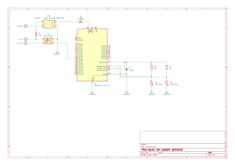

# towel-rail-system

This is a project based on [Raspberry Pi Pico
W](https://www.raspberrypi.com/documentation/microcontrollers/pico-series.html)
which controls [an electric towel rail in a bathroom](https://www.victorianplumbing.co.uk/e-diamond-electric-only-heated-towel-rail-w480mm-x-h1375mm-chrome-straight).

The project is provided as an example of the use of my
[pico-wifi-settings library](https://github.com/jwhitham/pico-wifi-settings)
which supports "internet of things" (IoT) remote control projects
by enabling remote reconfiguration and firmware updates.

pico-wifi-settings manages WiFi connections for Pico firmware. Using the library,
I can update the configuration of the towel rail controller without needing
to open the control box or physically connect to Pico. I could,
for example, change my WiFi password or hotspot name, or set different
threshold temperatures and timings.

With pico-wifi-settings I'm even able to upload new firmware, so I can add
new features and fix bugs without physical access. This is useful because
the controller is not in a very accessible place (behind a bookshelf).

# Background

An electric heated towel rail helps to dry towels
and keep a bathroom warm, but it doesn't need to be switched on all
of the time. This controller integrates with my home automation
system and allows the towel rail to be switched on for short periods
when needed. It also reacts to the air temperature in the house, and
turns on for longer periods when it is cold.

[Raspberry Pi Pico
W](https://www.raspberrypi.com/documentation/microcontrollers/pico-series.html)
provides a great platform for this project. If anything, it is far more powerful than necessary.
This project uses only one of the CPU cores, underclocks the CPU to 48MHz to save
energy, and uses a small fraction of the available memory.

The Pico W is a low-cost device. It connects to WiFi, which provides the remote control
features that I wanted, and it connects easily to electronics such as
a solid state relay and thermistors, which allow it to control other devices and react to changes
in the environment.

The device has the following features:

- It periodically samples the ambient temperatures in the bedroom and bathroom using thermistors and reports these temperatures to another system using UDP messages.
- When activated by a UDP message, it activates the towel rail heater for a fixed time interval.
- The activation is conditional on the bathroom temperature: the towel rail can be turned on more often if the bathroom is cold.

# Software build and deploy

You'll need the [Pico SDK](https://github.com/raspberrypi/pico-sdk/) to build.

- use `setup.sh` to run the CMake configuration step
- use `build.sh` to build

In my working copy, I have two additional files in the repository root:
`wifi-settings-file` and `remote_picotool.cfg`. These are based on the sample
files `wifi-settings-file.sample` and `remote_picotool.cfg.sample` but I have
added my own WiFi details and shared secret. These allow me to use the following
commands:

- `./remote_picotool.py update_reboot wifi-settings-file` to upload
  the wifi-settings-file to the Pico: for example, to add a new WiFi hotspot
  or change one of the temperature thresholds.
- `./remote_picotool.py ota build/fw/main.uf2` to upload new firmware to the Pico.
- `python remote_status.py` to get a status report containing the temperature and
  internal status of the controller.

# Hardware
# Hardware design

The circuit diagram ([kicad files](tr)):

Experiences from the similar [ventilation-system
controller project](https://github.com/jwhitham/ventilation-system)
helped me to avoid some pitfalls. I used thermistors with known
properties, avoiding the need to discover the "beta" value by experiment.

Very few additional components are required. The most interesting is the
[TL431A](https://www.ti.com/lit/ds/symlink/tl431.pdf) reference voltage device,
without which, the Pico's internal temperature sensor is not accurate. It is
configured to maintain ADC\_VREF at 2.5 volts (the most basic configuration). This
is not required for the thermistors, since each is part of a voltage divider, and the
ADC only measures the ratio between the fixed resistance (15k) and the thermistor.

Mindful of the fact that the controller would be installed in a bedroom,
on the other side of a bathroom wall, I avoided using a conventional
mechanical relay for the control output, and instead used a (silent)
[solid state relay module](https://www.fotek.com.tw/en-gb/product-category/143),
which also cuts down on the components required,
as it can be switched directly from a GPIO pin at 3.3V. It does not require
a 12V supply, a switching transistor or a diode for back emf.

A solid state relay for 240 volt a.c. contains a triac
and opto-isolator, and an equivalent can be built on a circuit
board from discrete components,
but I do not like building circuits involving mains electricity
because of the serious problems that can occur if anything goes wrong
and the extreme care that is required during construction. For mains,
I prefer to use pre-built modules with safety certifications
(e.g. CE mark). The 5V power supply for this project is another example of this,
specifically chosen because of its safety rating.
